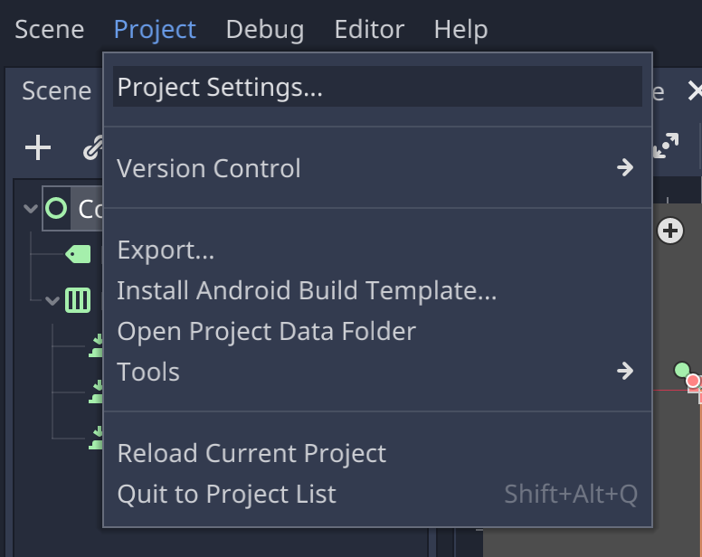
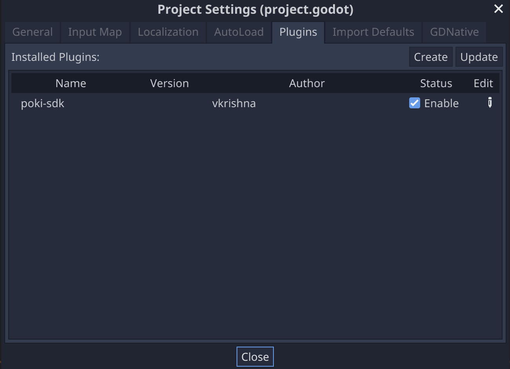
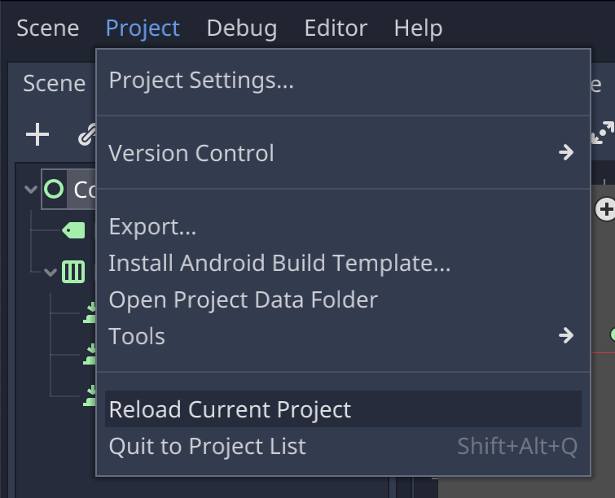
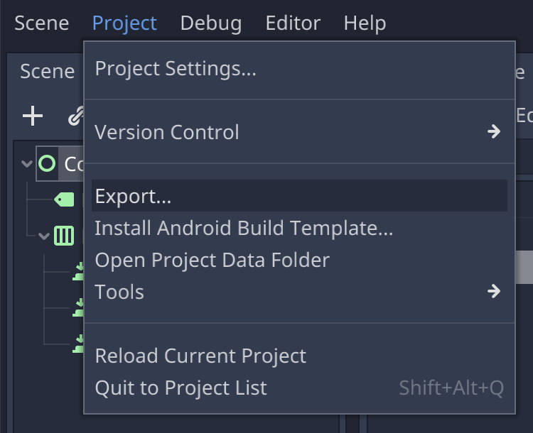
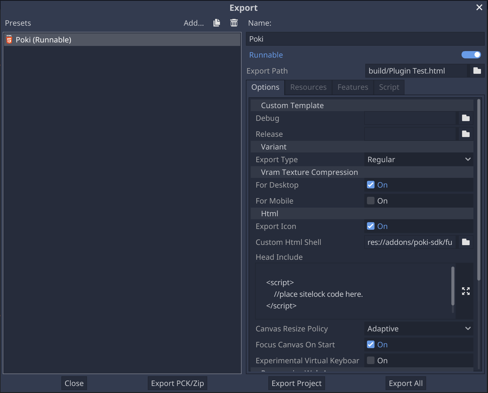
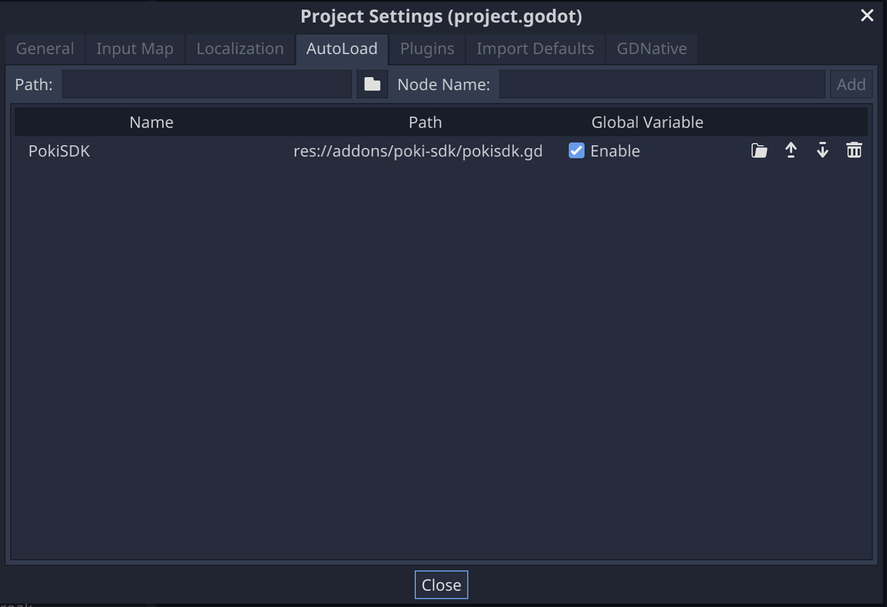

# Poki plugin for Godot 3.4
`Note: This plugin will work for Godot 3.4 and above`

This plugin is designed to help the integration of the [PokiSDK](https://sdk.poki.com/html5/) into your Godot(3.4.x) game. You can build the integration yourself by creating a custom html shell by modifying the [default template](https://github.com/godotengine/godot/blob/master/misc/dist/html/full-size.html). This plugin makes it easier and faster for you to do the same. 

The plugin provides:
- An export preset for Poki platform
- A custom html shell 
- PokiSDK singleton for making  
- A demo scene showcasing usage

Once you install and enable the extension, you will be able to test the PokiSDK integration in preview mode (in browser) and be able to make builds (web-mobile) that can be uploaded to poki platform. 

Please note that Poki is a curated platform, you will need to submit your game through pokifordevelopers.com first, and only work on the sdk integration after the game is approved.

## 1.Installation
There are two ways to download and install the plugin

### AssetLibrary
You can search and install the plugin directly from the official Asset Library.
This is the easiest way to get started.
//screenshots of the store and install process. 

### From Source/Release
Download the plugin archive [poki-sdk-v1.0.zip](). 

Or download the source code and copy `poki-sdk` directory to your project's `addons` directory. 
``` 
git clone https://github.com/vkbsb/godot-poki-sdk.git
```

1. Once this is done, you can launch the plugin manager in Godot editor

2. Switch to the plugins tab and make sure that the plugin is enabled. 

3. Reload the current project



## 2.Export preset
Once you have done the installation, go to export dialog. 

1. Open the export dialog



2. Under Presets you should see an entry called "Poki"



The extension creates the following files in your project directory.
- Adds a new preset called `Poki` to export config in project.
- Adds a Auto load Singleton called `PokiSDK` for the game script to use.



## 3.Usage 
In your node scripts, you will be able to use PokiSDK to interact with the platform. The following are the functions that are available for you to use from your game scripts. Checkout the demo.gd for example usage.

```python
PokiSDK.gameplayStart() #-- in JS it's PokiSDK.gameplayStart()
PokiSDK.gameplayStop() #-- in JS it's PokiSDK.gameplayStop()
PokiSDK.commercialBreak() #-- in JS it's PokiSDK.commercialBreak()
PokiSDK.rewardBreak() #-- in JS it's PokiSDK.rewardedBreak()
PokiSDK.shareableURL(params) #-- in JS it's PokiSDK.shareableURL({}).then(url => {})
```

You will notice that you do not see an equivalent to ``PokiSDK.setDebug(value)`` this is because the extension sets this automatically based on where the game is hosted.
```
________________________________________________________
| HostName                    | PokiSDK Debug           |
|_____________________________|_________________________|
| localhost                   | PokiSDK.setDebug(true) |
| 127.0.0.1                   | PokiSDK.setDebug(true) |
| //any other hostname        | PokiSDK.setDebug(false)|
---------------------------------------------------------
```
`Note: You can change this behaviour by editing the exported html file. `

**Rewarded Break**

This ad type is used for optional rewarded actions, for example watching an ad video in exchange for in-game currency, a revive, a level skip... Here are the following steps you need to follow to implement it using this extension. 
- Register for a call back on `cc.game` for `EVENT_REWARD_BREAK_DONE`
- if `arguments[0] == true` we can give player reward, else don't reward.  

Check out [DemoScript.ts](./templates/demo/DemoScript.ts) for reference. 


**SiteLock**

Poki provides a sitelock code to the developers which helps ensure that the game is playable only on Poki's website. Please collect it from your dev contact. Once you get it, paste the code in the ``SiteLock`` field of the ``poki-sdk`` section of the ``web-mobile`` build. 


Please note that the sitelock code is embedded in the build only when you make a build with debug box un-checked. 


**Submit your game on Poki**

On [developers.poki.com](https://developers.poki.com/) you can submit your game with Poki. If we think your game is a good fit for our playground, we will reach out to you!
