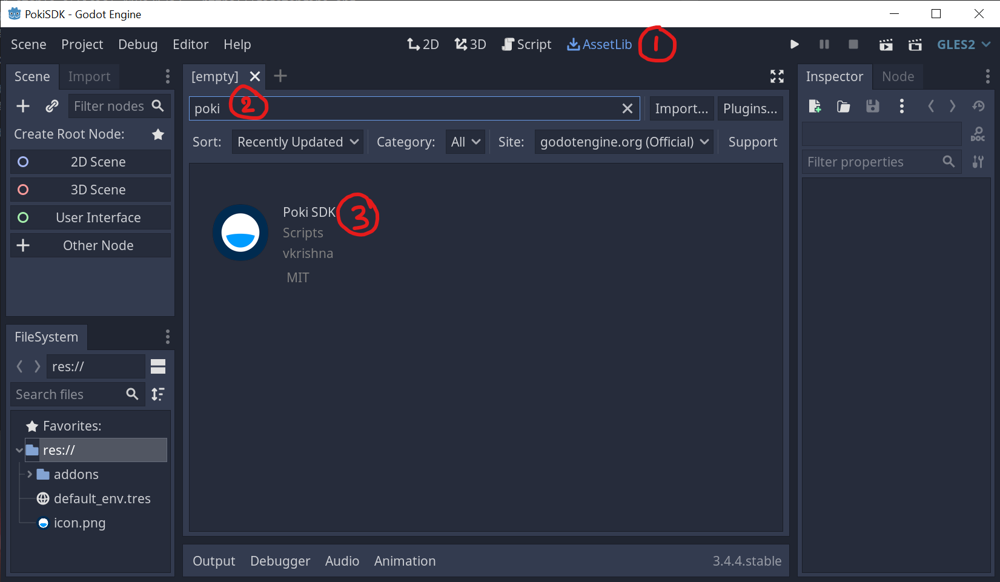
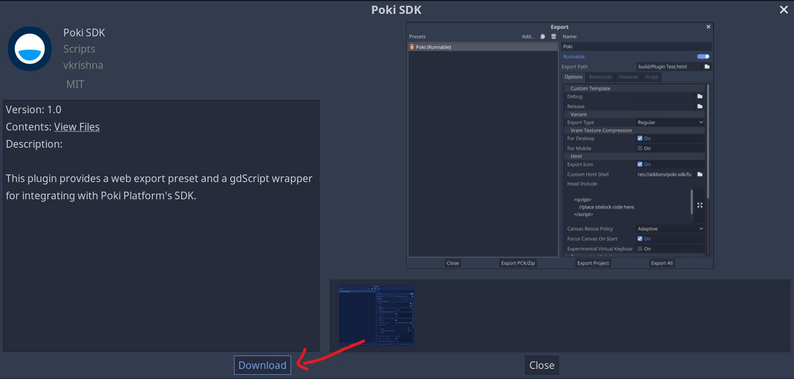
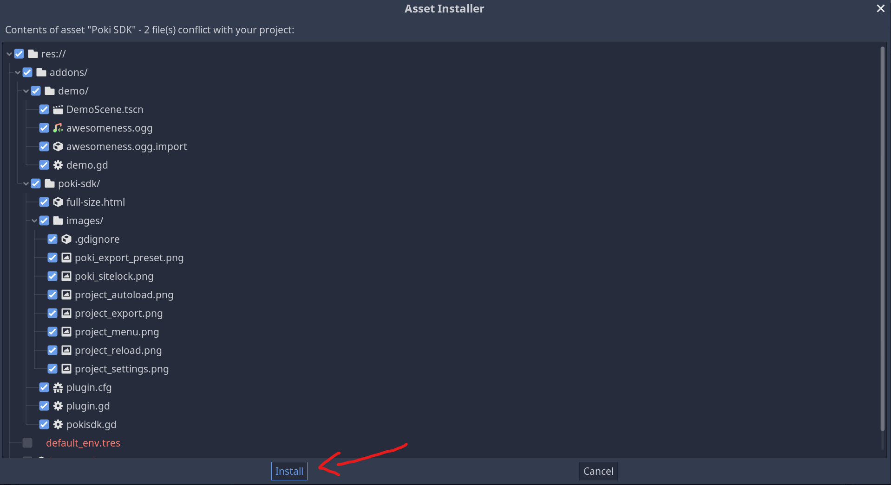
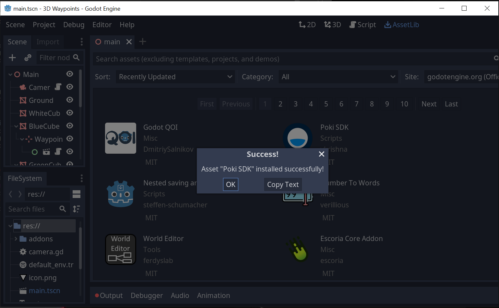
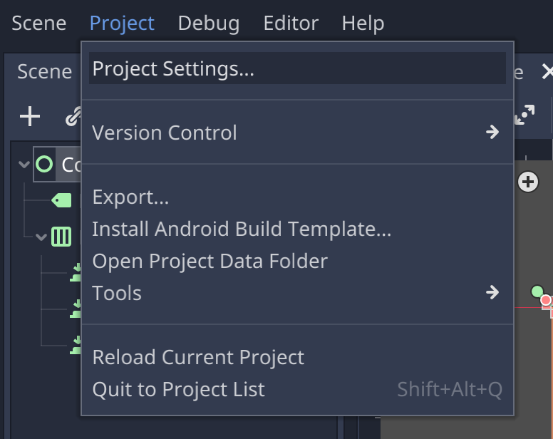
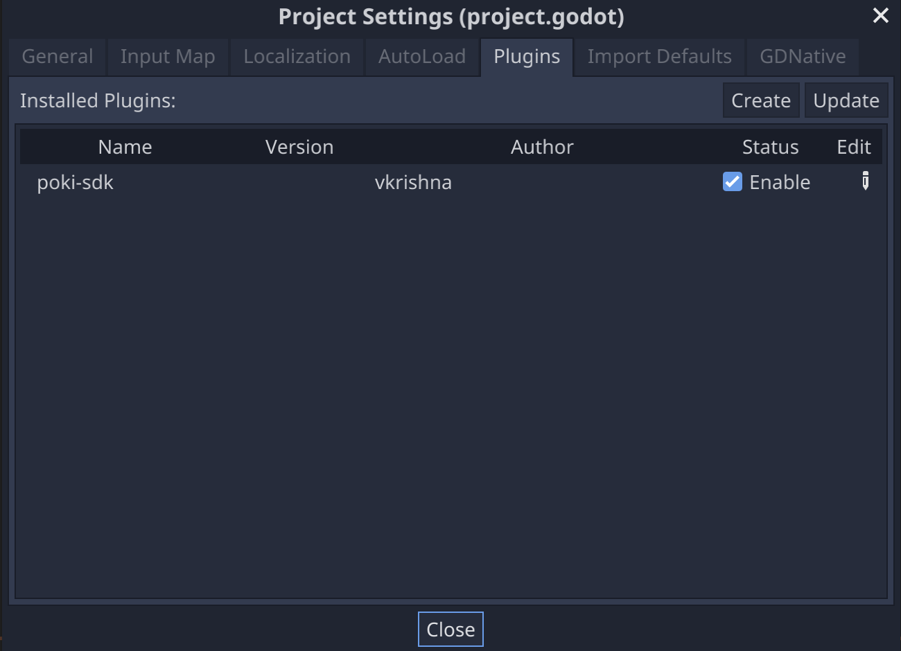
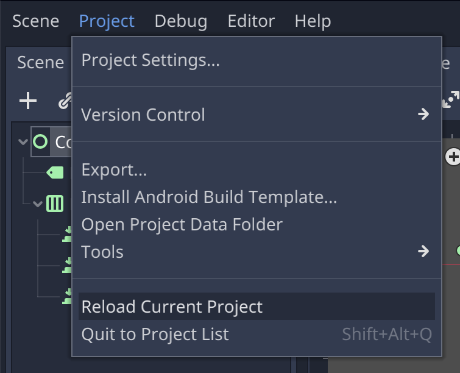
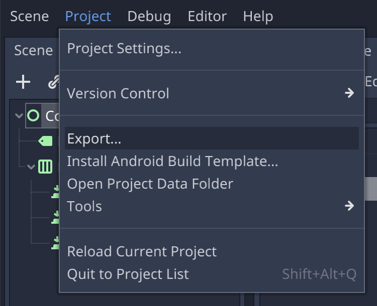
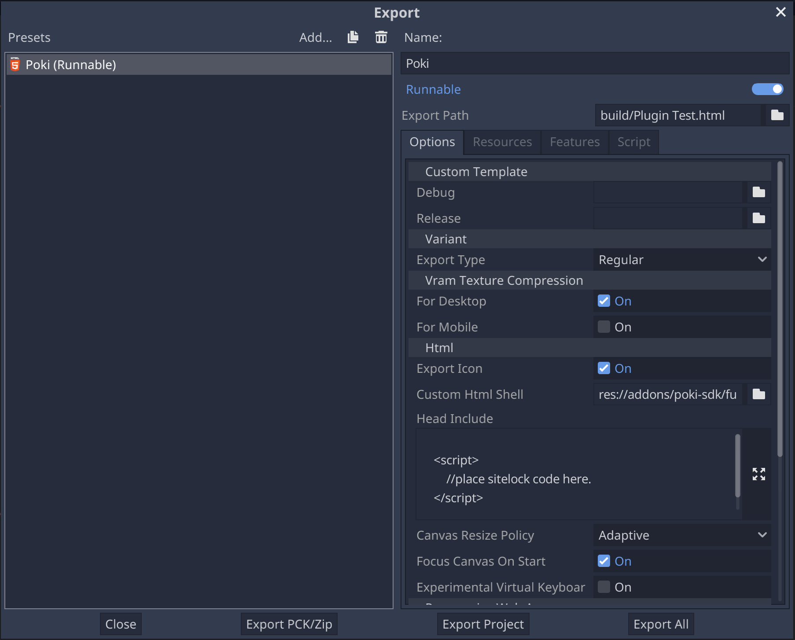
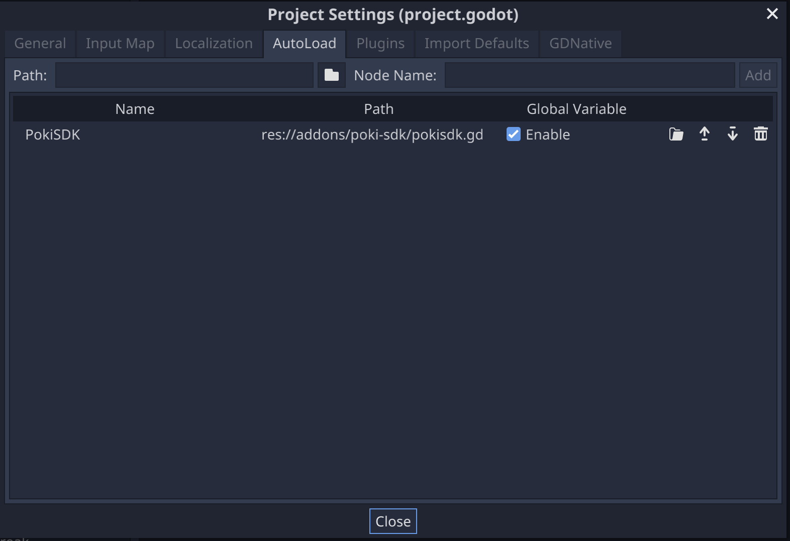

# Poki plugin for Godot 4.3
`Note: This plugin works for Godot 4.3 and above`

This plugin is designed to help the integration of the [PokiSDK](https://sdk.poki.com/html5/) into your Godot(4.3.x) game. It is possible to build the integration yourself by creating a custom html shell by modifying the [default template](https://github.com/godotengine/godot/blob/master/misc/dist/html/full-size.html), but this plugin makes it easier and faster for you to do the same. 

This plugin provides:
- An export preset for the Poki platform
- A custom html shell 
- PokiSDK singleton for GDScript integration
- A demo scene showcasing usage

Once you install the plugin and reload the project, you will see a new preset for HTML5 platform called Poki. This will provide the core integration needed for the [PokiSDK](https://sdk.poki.com/html5/) by using a custom html shell. You will be able to make api calls using the `PokiSDK` singleton that will be autoloaded for you. 

Please note that Poki is a curated platform, you will need to submit your game through [Poki for Developers](https://developers.poki.com/) first, and only work on the sdk integration after the game is approved.

## 1.Installation
There are two ways to download and install the plugin

### From AssetLibrary
You can search and install the plugin directly from the official Asset Library.
This is the easiest way to get started.

1) Switch to the AssetLib tab (1) and search for poki (2) using the search bar. Once you find it (3) click on it. 

[](./addons/poki-sdk/images/plugin_search.png)

2) You will be shown the details of the plugin. Click the download button.

[](./addons/poki-sdk/images/plugin_download.png)

3) Once the download is finished, you will be shown the install dialog box. Click on the install button. 

[](./addons/poki-sdk/images/plugin_install.png)

4) If everything goes well, you will see a dialog box showing that you have successfully installed the plugin. 

[](./addons/poki-sdk/images/plugin_installed.png)


### From Source/Release
Download the plugin archive [godot-poki-sdk-master.zip](https://github.com/vkbsb/godot-poki-sdk/archive/refs/heads/master.zip). 

Or download the source code and copy the `poki-sdk` directory into your project's `addons` directory. 
``` 
git clone https://github.com/vkbsb/godot-poki-sdk.git
```

1. Once this is done, you can launch the plugin manager in Godot editor under project settings.

[](./addons/poki-sdk/images/project_menu.png)

2. Switch to the plugins tab to make sure that the plugin is enabled. 

[](./addons/poki-sdk/images/project_settings.png)

3. Reload the current project.

[](./addons/poki-sdk/images/project_reload.png)

      

## 2.Export preset
Once you have finished the installation, you need to export your preset. 

1. Open the export dialog

[](./addons/poki-sdk/images/project_export.png)

2. Under Presets you should see an entry called "Poki"

[](./addons/poki-sdk/images/poki_export_preset.png)

The extension creates the following files in your project directory :
- Adds a new preset called `Poki` to export config in project.
- Adds an automatically loaded singleton called `PokiSDK` for the game script to use.

[](./addons/poki-sdk/images/project_autoload.png)

## 3. Usage
The plugin autoloads a singleton called `PokiSDK`. In Godot scripts you call it directly, while the exported HTML shell initializes the underlying browser SDK before the Godot engine starts.

### Startup
The exported shell is the only place where the browser `PokiSDK.init()` call happens. It runs before the Godot engine starts, so the Godot autoload does **not** expose a public `PokiSDK.init()` method.

By default, the shell enables Poki debug mode on `localhost` and `127.0.0.1`. You can still override that at runtime with `PokiSDK.setDebug(false)` or enable logging later with `PokiSDK.setLogging(true)`.

Note: to fully understand the difference between `commercialBreak()` and `rewardedBreak()`, refer to the [PokiSDK events documentation](https://sdk.poki.com/sdk-documentation.html#definition-of-events).

### Available methods
Lifecycle and monetization:

```gdscript
PokiSDK.gameLoadingFinished()
PokiSDK.gameplayStart()
PokiSDK.gameplayStop()
PokiSDK.commercialBreak()
PokiSDK.commercialBreak(Callable(self, "_on_ad_started"))
PokiSDK.rewardedBreak()
PokiSDK.rewardedBreak(Callable(self, "_on_ad_started"))
PokiSDK.rewardedBreak({
	"size": "small", # accepted values: small, medium, large
	"onStart": Callable(self, "_on_ad_started"),
})
```

Sharing, URL helpers, and accounts:

```gdscript
PokiSDK.shareableURL({
	"id": "demo-user",
	"type": "reward",
	"score": 42,
})
PokiSDK.getURLParam("id")
PokiSDK.getLanguage()
PokiSDK.getUser()
PokiSDK.getToken()
PokiSDK.login()
```

Diagnostics, analytics, and playtest helpers:

```gdscript
PokiSDK.captureError("Something went wrong")
PokiSDK.setDebug(true)
PokiSDK.setLogging(true)
PokiSDK.enableEventTracking(123)
PokiSDK.openExternalLink("https://developers.poki.com/")
PokiSDK.movePill(50, -100)
PokiSDK.measure("demo", "button", "clicked")
PokiSDK.playtestSetCanvas(canvas_handle)
PokiSDK.playtestSetCanvas([canvas_a, canvas_b])
```

### Signals
Promise-based methods resolve through Godot signals:

```gdscript
commercial_break_done(response)
commercial_break_failed(error)

rewarded_break_done(response)
rewarded_break_failed(error)

shareable_url_ready(url)
shareable_url_failed(error)

user_ready(user_dict_or_null)
user_failed(error)

token_ready(token_or_null)
token_failed(error)

login_done()
login_failed(error)
```

The `User` payload is exposed as a Godot `Dictionary`:

```gdscript
{
	"username": "TestUser",
	"avatarUrl": "https://a.poki-cdn.com/img/placeholder_gradient.png",
}
```

### Examples
Basic ad flow:

```gdscript
func _on_play_again_pressed():
	$AudioStreamPlayer.stream_paused = true
	PokiSDK.gameplayStop()
	PokiSDK.commercialBreak(Callable(self, "_on_ad_started"))

func _on_commercial_break_done(_response):
	$AudioStreamPlayer.stream_paused = false
	PokiSDK.gameplayStart()
```

Account flow:

```gdscript
func _ready():
	PokiSDK.connect("user_ready", Callable(self, "_on_user_ready"))
	PokiSDK.getUser()

func _on_login_button_pressed():
	PokiSDK.login()
```

Move the Poki Pill, track a custom event, and open an approved external link:

```gdscript
PokiSDK.movePill(50, -100)
PokiSDK.measure("demo", "ui", "open_store")
PokiSDK.openExternalLink("https://developers.poki.com/")
```


**Submit your game on Poki**

Submit your game to Poki on [Poki for Developers](https://developers.poki.com/)! We will review your game, and if we think your game is a good fit for our playground, we will reach out to you!
